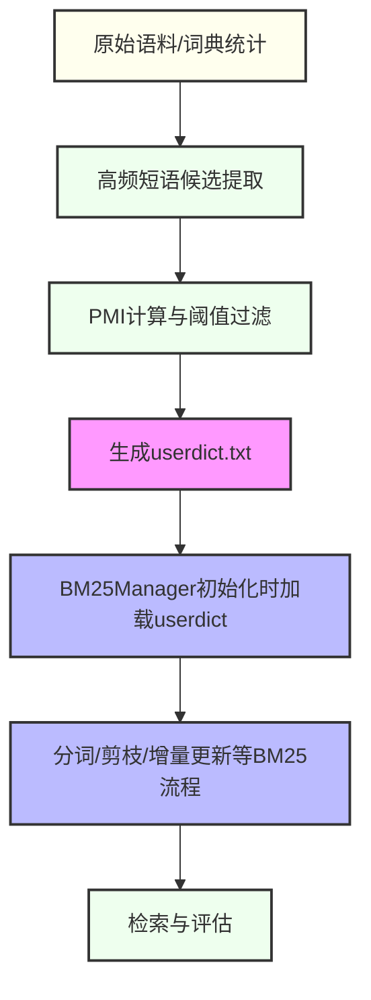

# 240703-BM25短语保护与动态用户词典技术方案

## 一、背景与目标

在RAG/检索系统中，常见的分词方法（如jieba）容易将领域专有名词或高频短语（如"阿苏焉尼""武器技能"）拆分，影响召回和排序效果。我们希望：
- 既能享受BM25Manager的高效剪枝、增量更新等优点；
- 又能动态保护高质量短语，保证其在分词和检索中的完整性。

## 二、方案概述

核心思路：
1. 从原始语料或词典统计中自动抽取高频短语（如二元组、三元组），结合频次和PMI（点互信息）过滤，得到高质量短语列表；
2. 动态生成jieba用户词典（userdict.txt），在BM25Manager初始化时加载，实现短语保护；
3. 其余BM25流程（剪枝、增量更新、IDF/TF计算等）保持不变。

## 三、整体流程



## 四、短语抽取算法

### 1. 高频短语候选统计
- 扫描所有相邻Token对（bigram）和三元组（trigram），统计其出现频次。
- 例如：统计"阿苏-焉尼""武器-技能"等组合在全语料中的出现次数。

### 2. PMI计算
- 对每个候选短语，计算点互信息（PMI）：

  $\mathrm{PMI}(w_1,w_2) = \log\frac{P(w_1,w_2)}{P(w_1)P(w_2)}$

- 其中：
  - $P(w_1,w_2)$ 为短语联合概率（共现频次/总窗口数）
  - $P(w_1)$、$P(w_2)$ 为各自的单独概率

### 3. 阈值过滤
- 设定频次阈值（如freq>20）和PMI阈值（如PMI>3.0），只保留高质量短语。
- 可根据实际数据分布微调阈值。

## 五、userdict.txt自动生成方法

- 将筛选后的短语写入userdict.txt，每行格式：

  ```
  阿苏焉尼 1000 n
  武器技能 800 n
  ...
  ```
- 词频（中间数字）可设为大于最高单字频次，词性填"n"或自定义。
- 每次BM25Manager重训练前可自动生成/更新。

## 六、与BM25Manager集成方式

1. BM25Manager初始化时，增加user_dict_path参数：

   ```python
   class BM25Manager:
       def __init__(self, ..., user_dict_path=None):
           if user_dict_path:
               import jieba
               jieba.load_userdict(user_dict_path)
           ...
   ```
2. 分词时自动保护短语，后续流程不变。

## 七、优缺点分析

### 优点
- **短语保护**：领域专有名词、常用短语不会被拆分，提升召回和排序质量。
- **自动化**：短语抽取、词典生成全流程可自动化，便于迭代。
- **兼容性好**：对现有BM25Manager和检索流程改动极小。
- **可扩展**：可定期人工校对、补充短语，持续优化。

### 潜在不足
- **阈值敏感**：频次/PMI阈值需结合实际数据调优。
- **短语歧义**：部分短语可能存在歧义，需人工校验。
- **性能影响**：极大词典可能影响分词速度，需控制短语数量。

## 八、可扩展性建议
- 支持人工维护的"白名单"短语，和自动抽取结果合并。
- 支持短语粒度的权重调整（如重要短语可设更高词频）。
- 可扩展到多语言、跨领域场景。

## 九、主流程自动化集成建议

- 推荐在主流程中**自动调用gen_userdict.py**，确保每次处理新语料时都能动态生成最新的userdict。
- userdict命名建议采用 `{filename}_dict.txt`，如 `aeldaricodex_dict.txt`，避免不同文件/批次互相覆盖，便于溯源和管理。
- 自动化流程如下：

  ```python
  import os
  # 假设 filename = 'aeldaricodex.md'
  userdict_path = f"{filename.split('.')[0]}_dict.txt"
  # 1. 每次都刷新userdict，保证分词和短语保护是最新的
  os.system(f"python3 evaltool/gen_userdict.py --f {filename} --out {userdict_path}")

  # 2. 再初始化 BM25Manager
  bm25 = BM25Manager(user_dict_path=userdict_path)
  bm25.fit([open(filename, 'r', encoding='utf-8').read()])
  # ...后续流程
  ```

- 这样可以保证分词、剪枝、稀疏向量等所有操作都用到最新的短语保护词典，分词口径与评测完全一致。
- 工程建议：如有多文件批量处理，可将所有文件合并后生成一个总userdict，或为每个文件单独生成userdict。

---

如需实施，可先实现短语统计与PMI计算脚本，自动生成userdict.txt，并在BM25Manager初始化时加载。 