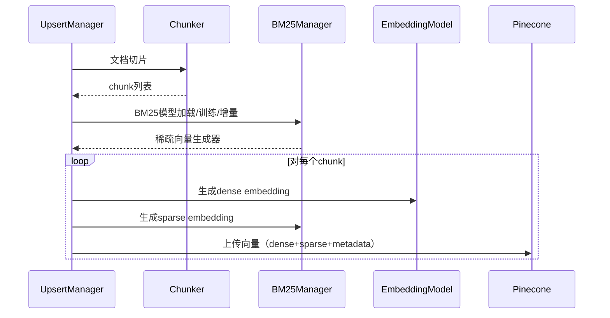

# 240705_向量化上传时的架构设计

## 1. 总体流程概述

本系统以`upsert.py`为主流程，负责将本地文档切片、向量化，并上传到 Pinecone 向量数据库。流程主要分为以下几个阶段：

1. **文档切片**：根据设定的切片器（支持v2/v3），将原始文档分割为结构化的文本块（chunk）。
2. **知识图谱写入**（可选）：抽取实体与关系，写入 Neo4j。
3. **向量化**：对每个 chunk 生成 dense embedding（稠密向量）和 sparse embedding（稀疏向量）。
4. **BM25 稀疏向量生成**：通过 BM25Manager 生成 chunk 的 sparse embedding。
5. **向量上传**：将 dense+sparse 向量及元数据批量上传到 Pinecone。
6. **BM25 模型管理**：支持模型加载、保存、增量更新，提升大规模文档处理效率。

---

## 2. 详细流程说明

### 2.1 文档切片
- 由 `SemanticDocumentChunker` 或 `DocumentChunker` 负责。
- 支持多级标题、元数据自动补全。
- 切片结果为带有内容和元数据的 chunk 列表。

### 2.2 向量化与上传
- 对每个 chunk：
  - 通过 embedding model 生成 dense embedding。
  - 通过 BM25Manager 生成 sparse embedding（见下文）。
  - 组装 metadata、id，批量上传到 Pinecone。
- 支持批量上传、失败重试、日志记录。

### 2.3 BM25 稀疏向量生成机制
- BM25Manager 负责管理 BM25 模型和词汇表。
- 对每个 chunk，调用 `get_sparse_vector(text)`，返回如下结构：
  ```python
  {
    "indices": [...],  # 稀疏向量非零项的词典索引
    "values": [...]    # 稀疏向量对应的权重
  }
  ```
- 稀疏向量与 dense embedding 一同上传，提升检索效果。

---

## 3. BM25Manager 功能与配置

### 3.1 主要功能
- **模型加载/保存**：支持从磁盘加载/保存 BM25 模型和词典。
- **训练/增量更新**：首次处理新文档时自动训练，后续文档支持增量更新，无需全量重训。
- **稀疏向量生成**：对任意文本 chunk 生成稀疏向量。

### 3.2 配置方法
- 通过 `BM25Config` 统一管理所有参数，支持环境变量覆盖。
- 常用配置项：
  | 配置项                | 环境变量名             | 默认值         | 说明                 |
  |----------------------|-----------------------|---------------|----------------------|
  | k1                   | BM25_K1               | 1.5           | BM25算法k1参数       |
  | b                    | BM25_B                | 0.75          | BM25算法b参数        |
  | min_freq             | BM25_MIN_FREQ         | 5             | 词频下限             |
  | max_vocab_size       | BM25_MAX_VOCAB_SIZE   | 10000         | 词汇表最大长度       |
  | model_dir            | BM25_MODEL_DIR        | models        | 模型保存目录         |
  | vocab_dir            | BM25_VOCAB_DIR        | dict          | 词典保存目录         |
  | model_filename       | BM25_MODEL_FILENAME   | bm25_model.pkl| 模型文件名           |
  | vocab_filename_pattern| BM25_VOCAB_FILENAME_PATTERN | bm25_vocab_{timestamp}.json | 词典文件名模式 |
  | enable_incremental   | BM25_ENABLE_INCREMENTAL| true         | 是否增量更新         |
  | save_after_update    | BM25_SAVE_AFTER_UPDATE| true          | 更新后自动保存       |
  | batch_size           | BM25_BATCH_SIZE       | 1000          | 上传批次大小         |
  | cache_size           | BM25_CACHE_SIZE       | 1000          | 缓存大小             |

- 配置优先级：环境变量 > 默认值。

### 3.3 用法示例

**环境变量配置（.env 或shell）：**
```bash
export BM25_K1=2.0
export BM25_B=0.8
export BM25_MODEL_DIR="custom_models"
```

**代码调用：**
```python
from dataupload.bm25_config import BM25Config
from dataupload.bm25_manager import BM25Manager

config = BM25Config()
manager = BM25Manager(
    k1=config.k1,
    b=config.b,
    min_freq=config.min_freq,
    max_vocab_size=config.max_vocab_size,
    user_dict_path="all_docs_dict.txt"
)
# 加载/训练/保存模型
model_path = config.get_model_path()
vocab_path = config.get_vocab_path()
if os.path.exists(model_path) and os.path.exists(vocab_path):
    manager.load_model(model_path, vocab_path)
else:
    manager.fit(["文本1", "文本2"])
    manager.save_model(model_path, vocab_path)
# 生成稀疏向量
vec = manager.get_sparse_vector("示例文本")
print(vec)
```

---

## 4. 典型流程时序图



---

## 5. 关键特性与优势
- 支持大规模文档增量入库，BM25模型自动管理。
- 稀疏+稠密向量混合检索，兼顾召回率与精度。
- 配置灵活，支持环境变量一键切换参数。
- 全流程自动化，日志与异常处理完善。

---

如需进一步扩展评估、可视化等功能，建议优先在主流程实现并复用。 