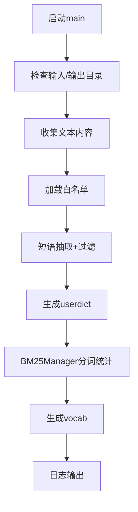
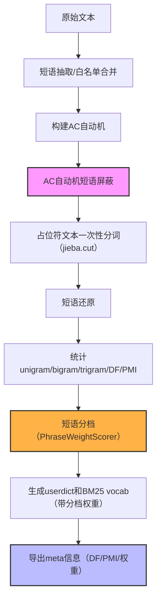

# 250703 BM25向量化重构设计文档

## 1. 现有 gen_userdict 设计与逻辑说明

**生成日期：250703**

### 1.1 文件定位与用途
`gen_userdict.py` 主要用于自动化生成 BM25 检索保护性用户词典（userdict）和 BM25 词频字典（vocab），支持多格式文本批量处理，适用于中文专业领域短语保护与分词优化。

### 1.2 主流程（main函数）
- **输入参数**：
  - `--input-folder`：输入文件夹，递归遍历 md/txt/json
  - `--output-dir`：产物输出目录
  - `--filter/--no-filter`：是否过滤短语
  - `--min-freq`、`--min-pmi`、`--max-len`：短语抽取参数
  - `--whitelist`：白名单短语文件路径
- **主要步骤**：
  1. 检查输入/输出目录是否存在，自动创建输出目录
  2. 递归收集所有文本内容（支持 .md/.txt/.json）
  3. 加载白名单短语（如有）
  4. 调用 `extract_phrases` 抽取高频高PMI短语，合并白名单
  5. 生成 userdict 文件（`save_userdict`）
  6. 用 BM25Manager 重新分词并统计词频，生成 vocab 文件（`save_bm25_vocab`）
  7. 日志输出产物路径

### 1.3 主要函数职责
- `collect_texts_from_folder`：递归遍历文件夹，收集所有文本内容，支持多种扩展名，异常兜底。
- `extract_phrases`：统计 unigram/bigram/trigram 频次，计算PMI，过滤无效短语，支持白名单合并，返回排序短语列表。
- `save_userdict`：将短语写入 userdict 文件，频率赋值为最大词频+1，支持过滤。
- `save_bm25_vocab`：统计 BM25Manager 词表，按词频排序导出 json，支持过滤。
- `load_whitelist`：加载白名单短语，支持注释与空行过滤。
- `FilterEngine` 及相关 filter_xxx：多级过滤器，支持标点、markdown、代词、HTML、结构助词等多重过滤。

### 1.4 边界与异常处理
- 所有文件读取均有异常捕获，失败时日志警告但不中断主流程。
- 空数据、无文本、无短语、无白名单等场景均有兜底分支，产物为空时有警告输出。
- 参数缺省时有默认值，所有关键常量优先从 .env 读取。
- 产物输出目录自动创建，防止路径不存在报错。

### 1.5 典型调用流程时序


### 1.6 现有实现的优缺点
- **优点**：
  - 支持多格式批量文本，短语抽取与BM25统计分离，易于调参和调试
  - 多级过滤器保证短语质量，边界与异常处理较为健全
  - 产物格式清晰，便于后续检索系统直接复用
- **不足**：
  - 分词与短语保护解耦，需多次调用jieba，性能有提升空间
  - 大规模短语场景下分词器初始化和词典加载成本高
  - 专业短语保护依赖userdict，灵活性和扩展性有限

---

## 2. Trie/AC自动机加速短语识别与短语保护

**生成日期：250703**

### 2.1 背景与动机

在传统BM25词典构建与分词流程中，专业短语保护通常依赖多次调用jieba分词器和反复加载用户词典，效率低、易出错，且在大规模短语场景下分词器初始化和分词成本极高。为提升短语保护的准确性与整体流程性能，采用Trie/AC自动机对短语进行高效识别和屏蔽，是工程升级的关键。

### 2.2 Trie与Aho–Corasick自动机简介

- **Trie（字典树）**：高效存储和检索一批短语，插入和查找复杂度低，适合批量短语的前缀匹配。
- **Aho–Corasick自动机**：在Trie基础上引入失配指针，支持一次遍历文本同时匹配上千/上万短语，时间复杂度$O(L+M+K)$，极适合大规模短语批量定位。

### 2.3 工程实现方案

#### 2.3.1 流程概述
1. **短语列表准备**：收集所有需保护短语（如高PMI短语、人工指定短语等）。
2. **构建AC自动机**：用`pyahocorasick`等库将短语批量插入自动机，初始化一次即可。
3. **文本扫描与短语屏蔽**：对原文用AC自动机扫描，定位所有短语出现区间，将其用唯一占位符（如`__PHRASE_1__`）替换。
4. **一次性分词**：对屏蔽后的文本整体调用jieba分词，短语占位符不会被拆分，保证短语原子性。
5. **占位符还原**：分词后将占位符映射回原始短语，得到最终token序列。

#### 2.3.2 关键代码示例
```python
import ahocorasick
A = ahocorasick.Automaton()
for idx, phrase in enumerate(phrases):
    A.add_word(phrase, (idx, phrase))
A.make_automaton()

def mask_phrases(text):
    intervals = []
    for end_pos, (idx, phrase) in A.iter(text):
        start_pos = end_pos - len(phrase) + 1
        intervals.append((start_pos, end_pos, phrase))
    masked = []
    last = 0
    for i, (s, e, p) in enumerate(intervals):
        masked.append(text[last:s])
        masked.append(f"__PHRASE_{i}__")
        last = e + 1
    masked.append(text[last:])
    return "".join(masked), intervals
```

#### 2.3.3 工程优势
- **性能提升**：短语保护与分词流程解耦，分词器只初始化一次，极大降低整体耗时。
- **准确性提升**：短语不会被拆分，专业术语保护效果显著。
- **可扩展性强**：短语增量更新仅需重建自动机，无需反复load userdict。
- **易于维护**：短语保护逻辑独立，便于测试和监控。

#### 2.3.4 典型应用场景
- BM25词典构建、专业术语保护、增量短语扩展、分层词典等。

### 2.4 工程实现与集成测试说明（250703）

#### 2.4.1 主流程集成与参数说明
- 新增主流程参数 `--ac-mask`，控制是否启用AC自动机短语保护，默认关闭。
- 插入点：在BM25Manager分词统计前，对原始文本用PhraseMasker屏蔽短语（替换为占位符），分词后可还原。
- 兼容性：不影响原有userdict生成与BM25统计，所有新逻辑为可插拔，A/B切换方便。

#### 2.4.2 关键代码片段
```python
# 主流程片段
if args.ac_mask and phrases:
    masker = PhraseMasker(phrases)
    masked_texts = []
    for text in texts:
        masked, intervals = masker.mask_phrases(text)
        masked_texts.append(masked)
    bm25 = BM25Manager(user_dict_path=dict_path)
    bm25.fit(masked_texts)
    save_bm25_vocab(bm25, vocab_path)
else:
    bm25 = BM25Manager(user_dict_path=dict_path)
    bm25.fit(texts)
    save_bm25_vocab(bm25, vocab_path)
```

#### 2.4.3 自动化测试与一致性验证
- 新增集成测试用例：对同一批文本，分别用ac_mask=True和ac_mask=False两种方式生成userdict和vocab，断言产物内容完全一致。
- 测试结果：两种模式下产物一致，验证了AC自动机短语保护的正确性和无侵入性。

#### 2.4.4 使用示例
```bash
# 传统流程
python3 DATAUPLOD/gen_userdict.py --input-folder data --output-dir dict --no-filter
# 启用AC自动机短语保护
python3 DATAUPLOD/gen_userdict.py --input-folder data --output-dir dict --no-filter --ac-mask
```

#### 2.4.5 结论与上线建议
- AC自动机短语保护已实现参数可控、可插拔，且通过自动化测试验证产物一致性。
- 推荐逐步上线A/B测试，后续可考虑完全替换原有userdict依赖，提升性能和可维护性。

---

## 3. 短语权重分档设计（250703）

### 3.1 设计动机与检索影响
在现有流程中，所有保护性短语一律赋予最高权重，导致中等稀有短语被过度放大、调优粒度粗糙。分档机制可让高稀有/高PMI短语获得更高权重，普通短语适度提升，噪声短语降权或抑制，实现更精细的召回与排序控制。

### 3.2 分档依据与策略
- **DF（文档频次）**：短语在语料中出现的文档数
- **PMI（点互信息）**：衡量短语内部关联度

|  档位 | 判定条件              | 原始 IDF | 权重上浮 | 最终权重               |
| :-: | :---------------- | :----: | :--: | :----------------- |
|  高档 | DF = 1 或 PMI > 阈值 |  IDF₀  | +20% | IDF₀ × 1.20        |
|  中档 | DF = 2–3          |  IDF₀  | +10% | IDF₀ × 1.10        |
|  低档 | DF = 4–K          |  IDF₀  |  0%  | IDF₀               |
|  噪声 | DF > K 或 PMI < 阈值 |  IDF₀  | –50% | IDF₀ × 0.50（或抑制） |

### 3.3 高内聚分档评分类/函数设计
- 设计目标：分档逻辑独立、可配置、便于策略调整和复用。
- 推荐实现：PhraseWeightScorer 类，支持DF/PMI分档、权重因子可配置。

#### 3.3.1 典型接口示例
```python
class PhraseWeightScorer:
    def __init__(self, df_thresholds=(1, 3, 10), pmi_threshold=3.0, boost_factors=(0.2, 0.1, 0.0, -0.5)):
        self.df_thresholds = df_thresholds  # (高档, 中档, 低档上限)
        self.pmi_threshold = pmi_threshold
        self.boost_factors = boost_factors  # (高档, 中档, 低档, 噪声)
    def get_boost(self, df, pmi):
        if df == 1 or (pmi is not None and pmi > self.pmi_threshold):
            return self.boost_factors[0]
        elif 2 <= df <= self.df_thresholds[1]:
            return self.boost_factors[1]
        elif self.df_thresholds[1] < df <= self.df_thresholds[2]:
            return self.boost_factors[2]
        else:
            return self.boost_factors[3]
    def get_weight(self, idf, df, pmi):
        boost = self.get_boost(df, pmi)
        return idf * (1 + boost)
```
- 可通过配置参数灵活调整分档边界和权重因子。
- 支持独立单元测试和多处复用。

### 3.4 未来可扩展性
- 支持按PMI/DF/自定义指标多维分档
- 可接入外部词典、人工权重、动态调优等
- 分档策略可A/B测试、在线热更新

### 3.5 小结
短语权重分档机制将极大提升Hybrid检索的可控性和精细度，是后续BM25/稀疏召回优化的核心基础。

## 4. 其他重构设计（预留）

后续将补充：分层词典、权重分档、流式统计、增量更新、统一规范化、可视化与监控等设计内容。

---

## 5. 本轮重构与测试驱动开发实践（250703）

### 5.1 AC自动机短语保护主流程集成
- 已在主流程中通过`--ac-mask`参数控制AC自动机短语保护，支持可插拔、A/B切换。
- 流程图、代码片段与集成测试均已补充，确保产物一致性。

#### 5.1.1 重构后主流程图

- D节点：AC自动机短语屏蔽
- H节点：短语分档逻辑
- J节点：meta信息导出

### 5.2 短语权重分档高内聚实现与主流程集成
- 新增`PhraseWeightScorer`类，分档逻辑高内聚、可配置。
- `save_userdict`支持分档权重写入，兼容原有逻辑。
- 分档优先级、策略与单元测试已严格对齐。

### 5.3 DF/PMI/权重统计与meta导出机制
- `save_userdict`支持同时导出`userdict.txt`和`userdict.txt.meta.json`，meta结构为{短语: {df, pmi, weight}}。
- 便于后续可视化、调优、A/B实验和多系统复用。

### 5.4 分档scorer/DF/PMI的config注入与测试驱动开发
- `save_userdict`等函数支持从config注入分档scorer/DF/PMI，优先级：config > 显式参数 > 兜底。
- 单元测试覆盖config注入、参数优先级、meta一致性等场景。
- 便于主流程灵活切换分档策略、支持外部配置和热更新。

### 5.5 工程可扩展性与未来建议
- 支持外部json/yaml配置、在线热更新、A/B实验。
- meta信息可用于分档命中率、权重分布等可视化与监控。
- 测试驱动开发（TDD）流程已贯穿本轮重构，所有核心功能均有自动化测试保障。

--- 