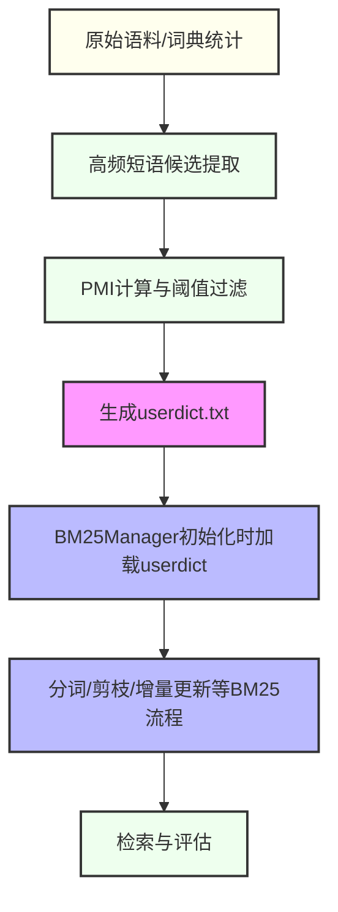
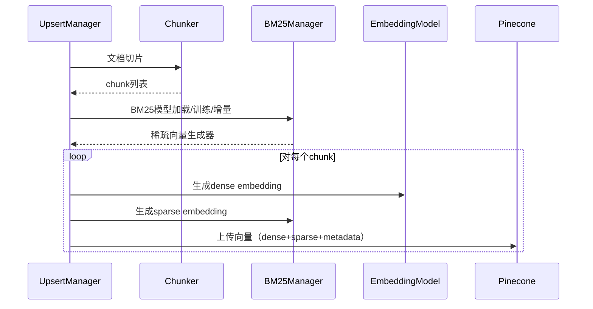

# 250703-向量化上传时支持hybrid检索的工程处理（补充于250703）

## 一、背景

随着RAG系统对检索召回率和业务覆盖的要求提升，单一dense向量检索已难以满足复杂场景。Pinecone官方hybrid检索方案支持同时利用dense（语义）和sparse（关键词）向量，显著提升召回效果。当前工程仅上传dense向量，未利用hybrid能力，需进行全链路改造。

## 二、目标

- 支持向Pinecone索引批量上传时，同时写入dense和sparse向量，实现hybrid检索能力。
- 保证兼容现有纯dense检索流程，便于平滑切换和A/B测试。
- 方案可扩展，便于后续支持多种sparse embedding模型。

## 三、方案设计

### 1. Pinecone索引要求
- 必须使用`vector_type="dense"`且`metric="dotproduct"`的index。
- dimension需与本地embedding模型一致。

### 2. 数据上传结构
- 每条向量数据需包含：
  - `id`: 唯一标识
  - `values`: dense向量（如OpenAI、Llama等）
  - `sparse_values`: sparse向量（如BM25、SPLADE、pinecone-sparse-english-v0等，格式为`{"indices": List[int], "values": List[float]}`）
  - `metadata`: 元数据

### 3. sparse向量生成
- 推荐使用官方或社区sparse embedding模型（如pinecone-sparse-english-v0、BM25/SPLADE等）。
- 支持本地生成或调用API。
- indices必须为int类型，values为float。

### 4. 代码实现要点
- 在`upsert.py`的向量化流程中，新增sparse embedding生成逻辑：
  1. 对每个chunk文本，先生成dense embedding，再生成sparse embedding。
  2. 组装upsert数据时，增加`sparse_values`字段。
  3. 调用`self.pinecone_index.upsert(vectors=batch)`时，batch内每条数据均含`sparse_values`。
- 兼容无sparse embedding时的降级处理（如仅上传dense）。

### 5. 兼容性与配置
- embedding模型、sparse模型、index名称、dimension等均通过config.py和.env统一配置。
- 支持通过开关参数控制是否启用hybrid上传。

## 四、注意事项

- sparse embedding的indices类型必须为int，否则Pinecone会报错。
- hybrid检索仅在dotproduct metric下生效。
- 若sparse embedding生成失败，需有降级/兜底策略，避免批量上传失败。
- 上传前建议对dense/sparse维度、类型做一致性校验。

## 五、落地建议

1. 优先在测试环境验证hybrid上传与检索全链路。
2. 逐步切换线上索引为dotproduct metric，确保兼容性。
3. 评估不同sparse embedding模型对业务效果的提升，结合评测工具做A/B实验。
4. 持续沉淀工程经验与最佳实践，完善文档与自动化测试。

## 工程实现要点（250703补充）

1. **BM25Manager实现**：
   - 独立bm25_manager.py，支持fit/增量更新/稀疏向量生成/保存加载，全部参数通过config.py和.env管理。
   - 稀疏向量严格按BM25公式，词表剪枝、增量更新用原始文本，避免token当文档。

2. **hybrid_search集成**：
   - vector_search.py中调用BM25Manager.get_sparse_vector生成稀疏向量，hybrid_scale方法支持alpha加权。
   - 检索、upsert、索引等全部参数通过config.py读取，禁止hardcode。

3. **配置项统一**：
   - 新增BM25_K1、BM25_B、BM25_MIN_FREQ等全部通过os.getenv()，并在config.py集中管理。

4. **测试用例**：
   - test_hybrid_search.py覆盖稀疏向量正确性、增量更新、hybrid_scale、异常处理等。

5. **最佳实践**：
   - 代码与文档均补丁式修订，所有magic number、KEY、模型名等均走配置文件，便于review和工程落地。

（250703补充，详见hybrid检索设计文档及补丁）

---

如需详细代码模板或遇到具体实现问题，可随时补充！ 

# AC 自动机与保护性词典协同重构设计文档（详细接口与伪代码）

> 时间戳：2024-07-04

## 一、目标与原则

- **批量保护**：对所有白名单短语（如专业术语、专有名词等）进行统一保护，防止被分词器拆分。
- **高效统计**：BM25 词典统计时，能正确统计所有白名单短语的出现频次。
- **接口清晰**：各功能模块职责单一，便于单元测试和后续维护。
- **可扩展性**：支持后续扩展更多短语保护/还原策略。

---

## 二、核心接口设计

### 1. PhraseMasker（短语掩码器）

#### 1.1 构造函数

```python
class PhraseMasker:
    def __init__(self, phrases: List[str]):
        # phrases: 白名单短语列表
        # 初始化AC自动机
        # 生成 phrase <-> placeholder 映射
```

#### 1.2 批量掩码接口

```python
def mask_texts(self, texts: List[str], embed_phrase: bool = True) -> Tuple[List[str], List[List[Tuple]], Dict[str, str]]:
    """
    对一批文本做短语掩码。
    :param texts: 原始文本列表
    :param embed_phrase: 是否在占位符中嵌入原始短语
    :return: (masked_texts, intervals_list, phrase2placeholder)
        - masked_texts: 掩码后的文本列表
        - intervals_list: 每条文本的短语区间及占位符信息
        - phrase2placeholder: phrase -> placeholder 映射
    """
```

#### 1.3 占位符还原接口

```python
def restore_text(self, masked_text: str, intervals: List[Tuple]) -> str:
    """
    将掩码文本还原为原始文本。
    :param masked_text: 掩码后的文本
    :param intervals: 掩码时记录的区间信息
    :return: 还原后的文本
    """
```

---

### 2. 分词与统计主流程

#### 2.1 分词接口

```python
def tokenize_texts(texts: List[str], userdict_path: str) -> List[List[str]]:
    """
    用jieba+userdict对一批文本分词。
    :param texts: 文本列表
    :param userdict_path: 保护性词典路径
    :return: 分词结果列表
    """
```

#### 2.2 BM25词典统计接口

```python
def build_bm25_vocab(token_lists: List[List[str]], phrase2placeholder: Dict[str, str]) -> Dict[str, int]:
    """
    统计BM25词典，自动将占位符还原为原始短语。
    :param token_lists: 分词结果列表
    :param phrase2placeholder: phrase -> placeholder 映射
    :return: 词频字典 {词: 频次}
    """
```

---

### 3. 主流程接口

```python
def process_texts_with_ac_mask(
    texts: List[str],
    phrases: List[str],
    userdict_path: str,
    embed_phrase: bool = True
) -> Dict[str, int]:
    """
    主流程：批量掩码、分词、统计BM25词典。
    :param texts: 原始文本列表
    :param phrases: 白名单短语列表
    :param userdict_path: 保护性词典路径
    :param embed_phrase: 是否在占位符中嵌入原始短语
    :return: BM25词频字典
    """
    # 1. 批量掩码
    masker = PhraseMasker(phrases)
    masked_texts, intervals_list, phrase2placeholder = masker.mask_texts(texts, embed_phrase=embed_phrase)
    # 2. 分词
    token_lists = tokenize_texts(masked_texts, userdict_path)
    # 3. 统计
    vocab = build_bm25_vocab(token_lists, phrase2placeholder)
    return vocab
```

---

## 三、伪代码实现

```python
# 1. 批量掩码
masker = PhraseMasker(phrases)
masked_texts, intervals_list, phrase2placeholder = masker.mask_texts(texts, embed_phrase=True)

# 2. 分词
import jieba
jieba.load_userdict(userdict_path)
token_lists = [list(jieba.cut(text)) for text in masked_texts]

# 3. 统计
vocab = {}
for tokens in token_lists:
    for token in tokens:
        # 判断是否为占位符
        if token.startswith("__PHRASE_"):
            # 方案一：占位符中直接嵌入原始短语
            # 例如 __PHRASE_0_阿苏焉尼__，直接提取"阿苏焉尼"
            phrase = token.split("_", 2)[-1].rstrip("_")
            vocab[phrase] = vocab.get(phrase, 0) + 1
        else:
            vocab[token] = vocab.get(token, 0) + 1
```

---

## 四、参数说明

- **texts**：原始文本列表，支持批量处理。
- **phrases**：白名单短语列表，支持任意数量。
- **userdict_path**：保护性词典路径，保证分词时短语不被拆分。
- **embed_phrase**：是否在占位符中嵌入原始短语，推荐为 True。

---

## 五、扩展与测试建议

- **PhraseMasker** 可扩展支持不同占位符格式、不同还原策略。
- **tokenize_texts** 可支持多种分词器（如jieba、thulac等）。
- **build_bm25_vocab** 可扩展为支持更多统计特征（如DF、PMI等）。
- **单元测试**：建议对掩码、分词、还原、统计各环节分别做测试，确保每个短语都能被保护和统计。

---

## 六、总结

- 该设计适用于**所有白名单短语**的批量保护和统计。
- 各接口职责清晰，便于维护和扩展。
- 方案兼容 AC 自动机和 jieba userdict 的优点，能高效、准确地保护和统计所有专业短语。

---

如需进一步细化某个接口的实现细节或示例代码，请随时告知！ 

# 240703-BM25短语保护与动态用户词典技术方案

## 一、背景与目标

在RAG/检索系统中，常见的分词方法（如jieba）容易将领域专有名词或高频短语（如"阿苏焉尼""武器技能"）拆分，影响召回和排序效果。我们希望：
- 既能享受BM25Manager的高效剪枝、增量更新等优点；
- 又能动态保护高质量短语，保证其在分词和检索中的完整性。

## 二、方案概述

核心思路：
1. 从原始语料或词典统计中自动抽取高频短语（如二元组、三元组），结合频次和PMI（点互信息）过滤，得到高质量短语列表；
2. 动态生成jieba用户词典（userdict.txt），在BM25Manager初始化时加载，实现短语保护；
3. 其余BM25流程（剪枝、增量更新、IDF/TF计算等）保持不变。

## 三、整体流程



## 四、短语抽取算法

### 1. 高频短语候选统计
- 扫描所有相邻Token对（bigram）和三元组（trigram），统计其出现频次。
- 例如：统计"阿苏-焉尼""武器-技能"等组合在全语料中的出现次数。

### 2. PMI计算
- 对每个候选短语，计算点互信息（PMI）：

  $\mathrm{PMI}(w_1,w_2) = \log\frac{P(w_1,w_2)}{P(w_1)P(w_2)}$

- 其中：
  - $P(w_1,w_2)$ 为短语联合概率（共现频次/总窗口数）
  - $P(w_1)$、$P(w_2)$ 为各自的单独概率

### 3. 阈值过滤
- 设定频次阈值（如freq>20）和PMI阈值（如PMI>3.0），只保留高质量短语。
- 可根据实际数据分布微调阈值。

## 五、userdict.txt自动生成方法

- 将筛选后的短语写入userdict.txt，每行格式：

  ```
  阿苏焉尼 1000 n
  武器技能 800 n
  ...
  ```
- 词频（中间数字）可设为大于最高单字频次，词性填"n"或自定义。
- 每次BM25Manager重训练前可自动生成/更新。

## 六、与BM25Manager集成方式

1. BM25Manager初始化时，增加user_dict_path参数：

   ```python
   class BM25Manager:
       def __init__(self, ..., user_dict_path=None):
           if user_dict_path:
               import jieba
               jieba.load_userdict(user_dict_path)
           ...
   ```
2. 分词时自动保护短语，后续流程不变。

## 七、优缺点分析

### 优点
- **短语保护**：领域专有名词、常用短语不会被拆分，提升召回和排序质量。
- **自动化**：短语抽取、词典生成全流程可自动化，便于迭代。
- **兼容性好**：对现有BM25Manager和检索流程改动极小。
- **可扩展**：可定期人工校对、补充短语，持续优化。

### 潜在不足
- **阈值敏感**：频次/PMI阈值需结合实际数据调优。
- **短语歧义**：部分短语可能存在歧义，需人工校验。
- **性能影响**：极大词典可能影响分词速度，需控制短语数量。

## 八、可扩展性建议
- 支持人工维护的"白名单"短语，和自动抽取结果合并。
- 支持短语粒度的权重调整（如重要短语可设更高词频）。
- 可扩展到多语言、跨领域场景。

## 九、主流程自动化集成建议

- 推荐在主流程中**自动调用gen_userdict.py**，确保每次处理新语料时都能动态生成最新的userdict。
- userdict命名建议采用 `{filename}_dict.txt`，如 `aeldaricodex_dict.txt`，避免不同文件/批次互相覆盖，便于溯源和管理。
- 自动化流程如下：

  ```python
  import os
  # 假设 filename = 'aeldaricodex.md'
  userdict_path = f"{filename.split('.')[0]}_dict.txt"
  # 1. 每次都刷新userdict，保证分词和短语保护是最新的
  os.system(f"python3 evaltool/gen_userdict.py --f {filename} --out {userdict_path}")

  # 2. 再初始化 BM25Manager
  bm25 = BM25Manager(user_dict_path=userdict_path)
  bm25.fit([open(filename, 'r', encoding='utf-8').read()])
  # ...后续流程
  ```

- 这样可以保证分词、剪枝、稀疏向量等所有操作都用到最新的短语保护词典，分词口径与评测完全一致。
- 工程建议：如有多文件批量处理，可将所有文件合并后生成一个总userdict，或为每个文件单独生成userdict。

---

如需实施，可先实现短语统计与PMI计算脚本，自动生成userdict.txt，并在BM25Manager初始化时加载。 

# 240705_向量化上传时的架构设计

## 1. 总体流程概述

本系统以`upsert.py`为主流程，负责将本地文档切片、向量化，并上传到 Pinecone 向量数据库。流程主要分为以下几个阶段：

1. **文档切片**：根据设定的切片器（支持v2/v3），将原始文档分割为结构化的文本块（chunk）。
2. **知识图谱写入**（可选）：抽取实体与关系，写入 Neo4j。
3. **向量化**：对每个 chunk 生成 dense embedding（稠密向量）和 sparse embedding（稀疏向量）。
4. **BM25 稀疏向量生成**：通过 BM25Manager 生成 chunk 的 sparse embedding。
5. **向量上传**：将 dense+sparse 向量及元数据批量上传到 Pinecone。
6. **BM25 模型管理**：支持模型加载、保存、增量更新，提升大规模文档处理效率。

---

## 2. 详细流程说明

### 2.1 文档切片
- 由 `SemanticDocumentChunker` 或 `DocumentChunker` 负责。
- 支持多级标题、元数据自动补全。
- 切片结果为带有内容和元数据的 chunk 列表。

### 2.2 向量化与上传
- 对每个 chunk：
  - 通过 embedding model 生成 dense embedding。
  - 通过 BM25Manager 生成 sparse embedding（见下文）。
  - 组装 metadata、id，批量上传到 Pinecone。
- 支持批量上传、失败重试、日志记录。

### 2.3 BM25 稀疏向量生成机制
- BM25Manager 负责管理 BM25 模型和词汇表。
- 对每个 chunk，调用 `get_sparse_vector(text)`，返回如下结构：
  ```python
  {
    "indices": [...],  # 稀疏向量非零项的词典索引
    "values": [...]    # 稀疏向量对应的权重
  }
  ```
- 稀疏向量与 dense embedding 一同上传，提升检索效果。

---

## 3. BM25Manager 功能与配置

### 3.1 主要功能
- **模型加载/保存**：支持从磁盘加载/保存 BM25 模型和词典。
- **训练/增量更新**：首次处理新文档时自动训练，后续文档支持增量更新，无需全量重训。
- **稀疏向量生成**：对任意文本 chunk 生成稀疏向量。

### 3.2 配置方法
- 通过 `BM25Config` 统一管理所有参数，支持环境变量覆盖。
- 常用配置项：
  | 配置项                | 环境变量名             | 默认值         | 说明                 |
  |----------------------|-----------------------|---------------|----------------------|
  | k1                   | BM25_K1               | 1.5           | BM25算法k1参数       |
  | b                    | BM25_B                | 0.75          | BM25算法b参数        |
  | min_freq             | BM25_MIN_FREQ         | 5             | 词频下限             |
  | max_vocab_size       | BM25_MAX_VOCAB_SIZE   | 10000         | 词汇表最大长度       |
  | model_dir            | BM25_MODEL_DIR        | models        | 模型保存目录         |
  | vocab_dir            | BM25_VOCAB_DIR        | dict          | 词典保存目录         |
  | model_filename       | BM25_MODEL_FILENAME   | bm25_model.pkl| 模型文件名           |
  | vocab_filename_pattern| BM25_VOCAB_FILENAME_PATTERN | bm25_vocab_{timestamp}.json | 词典文件名模式 |
  | enable_incremental   | BM25_ENABLE_INCREMENTAL| true         | 是否增量更新         |
  | save_after_update    | BM25_SAVE_AFTER_UPDATE| true          | 更新后自动保存       |
  | batch_size           | BM25_BATCH_SIZE       | 1000          | 上传批次大小         |
  | cache_size           | BM25_CACHE_SIZE       | 1000          | 缓存大小             |

- 配置优先级：环境变量 > 默认值。

### 3.3 用法示例

**环境变量配置（.env 或shell）：**
```bash
export BM25_K1=2.0
export BM25_B=0.8
export BM25_MODEL_DIR="custom_models"
```

**代码调用：**
```python
from dataupload.bm25_config import BM25Config
from dataupload.bm25_manager import BM25Manager

config = BM25Config()
manager = BM25Manager(
    k1=config.k1,
    b=config.b,
    min_freq=config.min_freq,
    max_vocab_size=config.max_vocab_size,
    user_dict_path="all_docs_dict.txt"
)
# 加载/训练/保存模型
model_path = config.get_model_path()
vocab_path = config.get_vocab_path()
if os.path.exists(model_path) and os.path.exists(vocab_path):
    manager.load_model(model_path, vocab_path)
else:
    manager.fit(["文本1", "文本2"])
    manager.save_model(model_path, vocab_path)
# 生成稀疏向量
vec = manager.get_sparse_vector("示例文本")
print(vec)
```

---

## 4. 典型流程时序图



---

## 5. 关键特性与优势
- 支持大规模文档增量入库，BM25模型自动管理。
- 稀疏+稠密向量混合检索，兼顾召回率与精度。
- 配置灵活，支持环境变量一键切换参数。
- 全流程自动化，日志与异常处理完善。

---

如需进一步扩展评估、可视化等功能，建议优先在主流程实现并复用。 