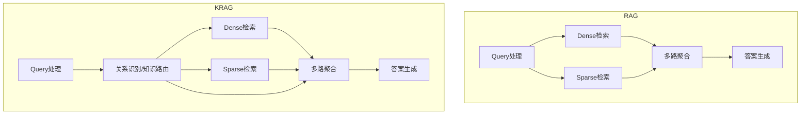

# 多路融合策略研究（250707）

## 1. 简单合并与去重（Union & Deduplication）
- **做法**：将各路召回（dense、sparse、KG等）结果简单合并，去重后作为候选集。
- **适用场景**：召回规模不大、对融合策略要求不高时。
- **优点**：实现简单，易于工程落地。
- **缺点**：无法充分利用各路召回的分数和特征，相关性排序不佳。

---

## 2. 线性加权融合（Weighted Sum/Linear Fusion）
- **做法**：为每一路召回结果分配权重（如dense分数×α + sparse分数×β + KG分数×γ），对候选文档加权打分，按总分排序。
- **主流实现**：百度、知乎等大厂RAG系统常用，权重可人工设定或通过自动调参获得。
- **优点**：可控性强，易于调优。
- **缺点**：权重设置依赖经验或调参，难以适应复杂场景。

---

## 3. 学习排序（Learning to Rank, LTR）
- **做法**：用机器学习模型（如LightGBM、XGBoost、神经网络等）对多路召回的特征（如各路分数、实体匹配、上下文相关性等）进行融合排序。
- **主流实现**：Google、微软、阿里等大厂检索系统广泛采用。
- **流程**：
  1. 构建训练集（query-文档对及其多路特征、人工标注的相关性标签）
  2. 训练LTR模型
  3. 线上融合时用模型对候选集打分排序
- **优点**：融合能力强，能自动学习最优排序策略。
- **缺点**：需要标注数据和特征工程，工程复杂度较高。

---

## 4. 多路召回+重排序（Rerank）
- **做法**：先用多路召回合并候选集，再用更强的模型（如cross-encoder、BERT/LLM reranker）对候选集进行重排序。
- **主流实现**：OpenAI、百度、知乎等RAG系统常用"bi-encoder召回 + cross-encoder重排"。
- **优点**：最终排序质量高，能充分利用上下文和语义信息。
- **缺点**：重排序模型推理成本高，适合候选集较小场景。

---

## 5. KG特征融合与证据链增强
- **做法**：将KG召回的结构化特征（如实体链、关系链、节点度等）作为融合排序的特征，或直接作为答案生成的"证据链"输入。
- **主流实现**：微软、阿里等在复杂问答和推理场景下常用。
- **优点**：提升可解释性和复杂推理能力。
- **缺点**：特征设计和融合策略需结合具体业务。

---

## 6. LLM/Agentic融合（答案生成前的智能聚合）
- **做法**：将多路召回结果（文本+KG片段）全部输入LLM/Agent，利用大模型的理解和推理能力自动聚合、筛选、重组信息，生成最终答案。
- **主流实现**：OpenAI、百度等RAG系统在复杂问答、COT推理场景下常用。
- **优点**：融合灵活，能处理复杂信息整合和推理。
- **缺点**：成本高，结果可控性弱，需配合评估体系。

---

## 7. 典型融合流程伪代码
```python
# 1. 简单合并去重
candidates = list(set(dense_results + sparse_results + kg_results))

# 2. 线性加权融合
def weighted_score(doc):
    return 0.5 * dense_score(doc) + 0.3 * sparse_score(doc) + 0.2 * kg_score(doc)
candidates.sort(key=weighted_score, reverse=True)

# 3. LTR融合
features = extract_features(candidates)
scores = ltr_model.predict(features)
candidates = [doc for _, doc in sorted(zip(scores, candidates), reverse=True)]

# 4. Cross-encoder重排序
rerank_scores = cross_encoder.predict(query, candidates)
final_candidates = [doc for _, doc in sorted(zip(rerank_scores, candidates), reverse=True)]

# 5. LLM/Agentic融合
final_answer = llm_generate_answer(query, final_candidates, kg_evidence)
```

---

## 8. 业界参考
- 百度/知乎/阿里：多路召回+LTR融合+cross-encoder重排
- OpenAI：多路召回+LLM聚合+人工评测
- 微软：KG证据链+多路召回+可解释性增强 

# KRAG 技术概设（250707）

## 1. KRAG与RAG的架构对比与复用

KRAG（Knowledge Routing-Augmented Generation）是在RAG（Retrieval-Augmented Generation）基础上演进而来，二者在整体架构上高度复用，但KRAG引入了"关系识别"与"知识路由"相关的新模块。

### 1.1 复用部分（RAG与KRAG共用）
- **Query处理（qProcessor）**：分词、实体识别、意图分析等，KRAG可直接复用RAG已有的query预处理能力。
- **Dense检索**：向量化query，检索向量库，召回相关文档。
- **Sparse检索**：关键词倒排索引检索，召回相关文档。
- **多路聚合/融合**：多路召回结果的合并、去重、重排序等聚合策略。

### 1.2 KRAG新增/强化的部分
- **关系识别与知识路由模块**：KRAG在query处理后，进一步识别query中的复杂关系、推理链、上下文依赖等。
- **知识路由（Knowledge Routing）**：根据识别到的关系，动态规划检索路径，支持多跳推理、多步检索，甚至Agent式"自我决策"。
- **多步推理与中间结果管理**：KRAG会将中间推理结果（如实体链、事件链、因果链）显式管理，并作为后续检索和生成的输入。

### 1.3 架构对比图（简化版）


### 1.4 典型流程对比
- **RAG**：用户query → Query处理 → Dense/Sparse检索 → 多路聚合 → 答案生成
- **KRAG**：用户query → Query处理 → 关系识别/知识路由 → Dense/Sparse检索（可多跳）→ 多路聚合 → 答案生成

### 1.5 代码伪例
```python
# RAG
entities = entity_recognition(query)
dense_results = dense_search(query)
sparse_results = sparse_search(query)
final_candidates = aggregate(dense_results, sparse_results)
answer = generate_answer(final_candidates)

# KRAG
entities, relations = entity_and_relation_recognition(query)
route_plan = knowledge_routing(entities, relations)
all_candidates = []
for step in route_plan:
    if step['type'] == 'dense':
        all_candidates += dense_search(step['query'])
    elif step['type'] == 'sparse':
        all_candidates += sparse_search(step['query'])
    # 还可以有KG检索、图推理等
final_candidates = aggregate(all_candidates)
answer = generate_answer(final_candidates)
```

---

## 2. KG相关逻辑在系统中的最佳归属

"KG相关逻辑"到底放在query_processor还是search_engine，是RAG/KRAG系统架构设计的一个关键决策点。

### 2.1 放在 query_processor 的情况
- 只做**实体识别、关系抽取**，不涉及实际的KG检索/推理。
- 主要目的是"理解query"，为后续检索提供结构化特征（如实体、关系、意图标签等）。
- 优点：逻辑清晰，便于后续模块统一消费结构化特征。
- 局限：如KG检索/推理本身很复杂，放在query_processor会让其职责过重。

### 2.2 放在 search_engine 的情况
- 需要**实际访问KG**，做实体/关系检索、路径推理、知识路由等。
- KG检索结果需要与dense/sparse检索结果一起做多路聚合、重排序。
- 优点：统一管理所有"召回"逻辑，便于多路融合和策略切换。
- 局限：需要query_processor输出足够的结构化信息供search_engine调用KG检索。

### 2.3 推荐方案（主流做法）
- **query_processor**：负责query的基础理解（分词、实体识别、关系抽取、意图分析），输出结构化query对象（如：{'text': ..., 'entities': [...], 'relations': [...]}）。
- **search_engine**：负责所有实际的"召回"操作，包括KG检索、dense检索、sparse检索、多路聚合等。KG相关的"召回/推理/路由"逻辑全部放在search_engine，便于统一管理和扩展。

### 2.4 伪代码示例
```python
# query_processor.py
def process_query(query_text):
    entities = entity_recognition(query_text)
    relations = relation_extraction(query_text)
    return {'text': query_text, 'entities': entities, 'relations': relations}

# search_engine.py
def hybrid_search(structured_query):
    kg_results = kg_search(structured_query['entities'], structured_query['relations'])
    dense_results = dense_search(structured_query['text'])
    sparse_results = sparse_search(structured_query['text'])
    return aggregate(kg_results, dense_results, sparse_results)
```

### 2.5 总结
- KG相关"理解"逻辑（实体/关系识别）放在query_processor。
- KG相关"检索/推理/路由"逻辑放在search_engine，与dense/sparse检索并列，统一聚合。
- 这样既保证了架构的清晰解耦，也便于后续扩展和维护。 