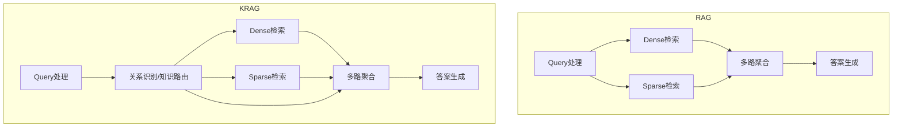

# KRAG 技术概设（250707）

## 1. KRAG与RAG的架构对比与复用

KRAG（Knowledge Routing-Augmented Generation）是在RAG（Retrieval-Augmented Generation）基础上演进而来，二者在整体架构上高度复用，但KRAG引入了"关系识别"与"知识路由"相关的新模块。

### 1.1 复用部分（RAG与KRAG共用）
- **Query处理（qProcessor）**：分词、实体识别、意图分析等，KRAG可直接复用RAG已有的query预处理能力。
- **Dense检索**：向量化query，检索向量库，召回相关文档。
- **Sparse检索**：关键词倒排索引检索，召回相关文档。
- **多路聚合/融合**：多路召回结果的合并、去重、重排序等聚合策略。

### 1.2 KRAG新增/强化的部分
- **关系识别与知识路由模块**：KRAG在query处理后，进一步识别query中的复杂关系、推理链、上下文依赖等。
- **知识路由（Knowledge Routing）**：根据识别到的关系，动态规划检索路径，支持多跳推理、多步检索，甚至Agent式"自我决策"。
- **多步推理与中间结果管理**：KRAG会将中间推理结果（如实体链、事件链、因果链）显式管理，并作为后续检索和生成的输入。

### 1.3 架构对比图（简化版）


### 1.4 典型流程对比
- **RAG**：用户query → Query处理 → Dense/Sparse检索 → 多路聚合 → 答案生成
- **KRAG**：用户query → Query处理 → 关系识别/知识路由 → Dense/Sparse检索（可多跳）→ 多路聚合 → 答案生成

### 1.5 代码伪例
```python
# RAG
entities = entity_recognition(query)
dense_results = dense_search(query)
sparse_results = sparse_search(query)
final_candidates = aggregate(dense_results, sparse_results)
answer = generate_answer(final_candidates)

# KRAG
entities, relations = entity_and_relation_recognition(query)
route_plan = knowledge_routing(entities, relations)
all_candidates = []
for step in route_plan:
    if step['type'] == 'dense':
        all_candidates += dense_search(step['query'])
    elif step['type'] == 'sparse':
        all_candidates += sparse_search(step['query'])
    # 还可以有KG检索、图推理等
final_candidates = aggregate(all_candidates)
answer = generate_answer(final_candidates)
```

---

## 2. KG相关逻辑在系统中的最佳归属

"KG相关逻辑"到底放在query_processor还是search_engine，是RAG/KRAG系统架构设计的一个关键决策点。

### 2.1 放在 query_processor 的情况
- 只做**实体识别、关系抽取**，不涉及实际的KG检索/推理。
- 主要目的是"理解query"，为后续检索提供结构化特征（如实体、关系、意图标签等）。
- 优点：逻辑清晰，便于后续模块统一消费结构化特征。
- 局限：如KG检索/推理本身很复杂，放在query_processor会让其职责过重。

### 2.2 放在 search_engine 的情况
- 需要**实际访问KG**，做实体/关系检索、路径推理、知识路由等。
- KG检索结果需要与dense/sparse检索结果一起做多路聚合、重排序。
- 优点：统一管理所有"召回"逻辑，便于多路融合和策略切换。
- 局限：需要query_processor输出足够的结构化信息供search_engine调用KG检索。

### 2.3 推荐方案（主流做法）
- **query_processor**：负责query的基础理解（分词、实体识别、关系抽取、意图分析），输出结构化query对象（如：{'text': ..., 'entities': [...], 'relations': [...]}）。
- **search_engine**：负责所有实际的"召回"操作，包括KG检索、dense检索、sparse检索、多路聚合等。KG相关的"召回/推理/路由"逻辑全部放在search_engine，便于统一管理和扩展。

### 2.4 伪代码示例
```python
# query_processor.py
def process_query(query_text):
    entities = entity_recognition(query_text)
    relations = relation_extraction(query_text)
    return {'text': query_text, 'entities': entities, 'relations': relations}

# search_engine.py
def hybrid_search(structured_query):
    kg_results = kg_search(structured_query['entities'], structured_query['relations'])
    dense_results = dense_search(structured_query['text'])
    sparse_results = sparse_search(structured_query['text'])
    return aggregate(kg_results, dense_results, sparse_results)
```

### 2.5 总结
- KG相关"理解"逻辑（实体/关系识别）放在query_processor。
- KG相关"检索/推理/路由"逻辑放在search_engine，与dense/sparse检索并列，统一聚合。
- 这样既保证了架构的清晰解耦，也便于后续扩展和维护。 