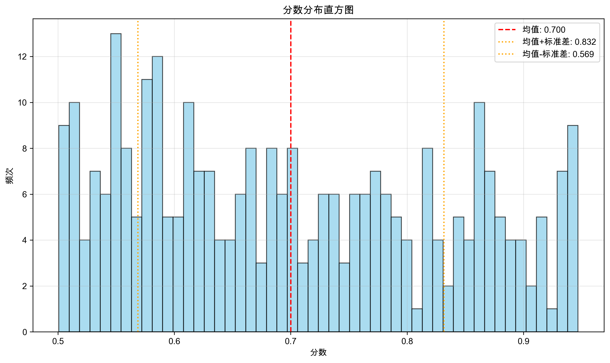
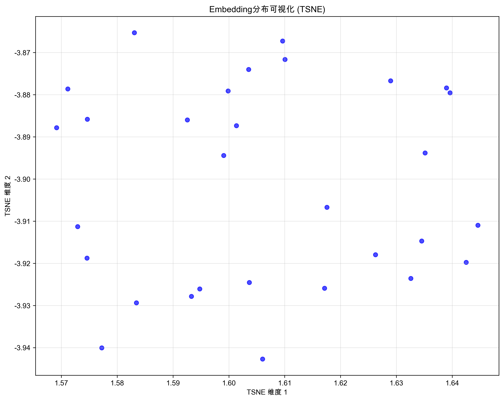

# 评估可视化总结

生成时间: 2025-07-11T11:14:55.820866

## 配置信息
- Query文件: myquery.json
- Gold文件: None
- Top-K: 10
- Query处理模式: straight
- 检索引擎类型: dense

## 评估结果
### score_distribution
- hist: [0, 0, 0, 0, 0, 0, 0, 0, 0, 0, 0, 0, 0, 0, 0, 0, 0, 0, 0, 0, 0, 0, 0, 0, 0, 19, 13, 22, 18, 18, 18, 15, 10, 12, 14, 12, 14, 9, 14, 13, 7, 9, 11, 19, 8, 8, 9, 8, 0, 0]
- bin_edges: [0.0, 0.02, 0.04, 0.06, 0.08, 0.1, 0.12, 0.14, 0.16, 0.18, 0.2, 0.22, 0.24, 0.26, 0.28, 0.3, 0.32, 0.34, 0.36, 0.38, 0.4, 0.42, 0.44, 0.46, 0.48, 0.5, 0.52, 0.54, 0.56, 0.58, 0.6, 0.62, 0.64, 0.66, 0.68, 0.7000000000000001, 0.72, 0.74, 0.76, 0.78, 0.8, 0.8200000000000001, 0.84, 0.86, 0.88, 0.9, 0.92, 0.9400000000000001, 0.96, 0.98, 1.0]
- mean: 0.7001772341292973
- std: 0.1314955949479228
- min: 0.5007499542530089
- max: 0.9468710624207803

### embedding_distribution
- method: tsne
- shape: (30, 2)
- sample_count: 30

## 可视化文件
- score_distribution: score_distribution.png
  - 描述: score_distribution可视化结果
  - 生成时间: 2025-07-11T11:14:56.352199

- embedding_distribution: embedding_distribution.png
  - 描述: embedding_distribution可视化结果
  - 生成时间: 2025-07-11T11:14:57.550798

